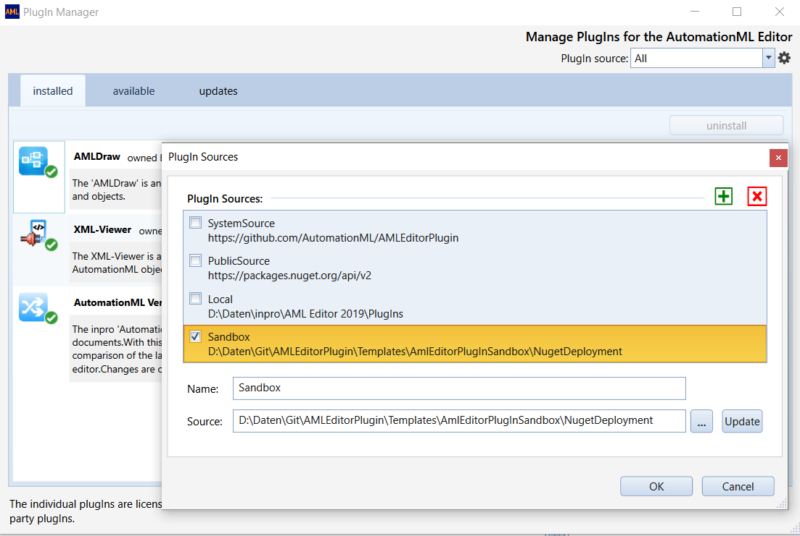
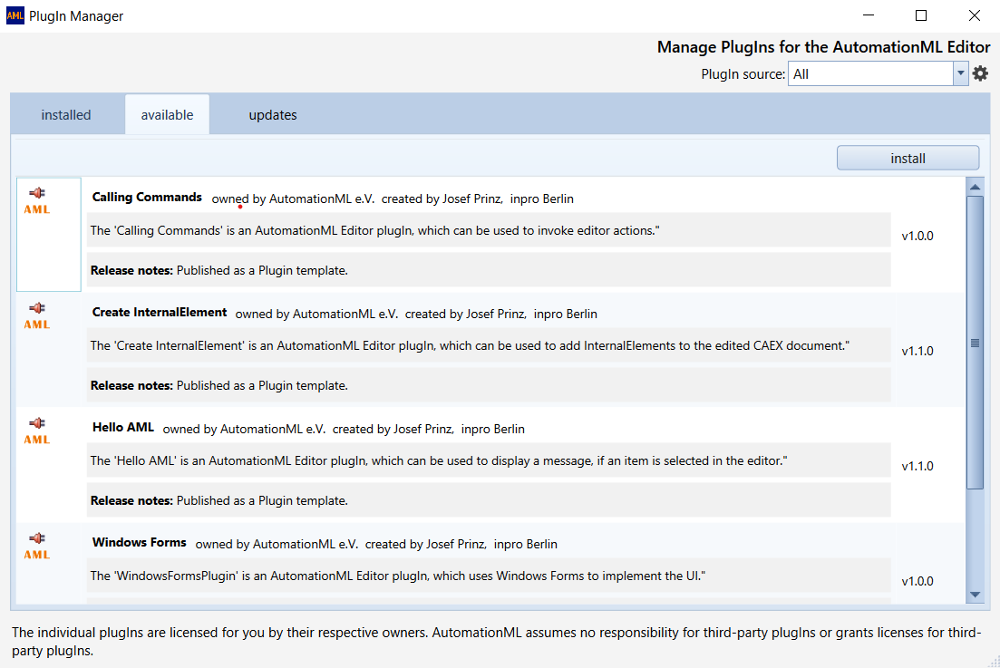

---

![][1]

---

# Aml.Editor.Plugin

#### Overview
This repository provides an implementation guide and sources which explain, how to develop PlugIns for the [AutomationML Editor](https://github.com/AutomationML/AutomationMLEditor/blob/main/README.md).

The AutomationML Editor uses a contract DLL for PlugIn Development, [Aml.Editor.Plugin.Contract](https://www.nuget.org/packages/Aml.Editor.Plugin.Contract).  The contract DLL contains interface classes, defining the API to access data, edited by the AutomationML Editor and to call commands to execute editor actions. 

Until **Version 6.3** of the AutomationML Editor the API was based on the [Microsoft Extensibility Framework (MEF)](https://docs.microsoft.com/en-us/dotnet/framework/mef/). Since **Version 6.4** the editor uses the [.NET AssemblyLoadContext](https://learn.microsoft.com/en-us/dotnet/api/system.runtime.loader.assemblyloadcontext?view=net-9.0). The `AssemblyLoadContext` type is a special type in the .NET runtime that allows to isolate loaded assemblies into different groups to ensure that assembly versions don't conflict. Earlier PlugIn implementations must be converted to the new loading technology. The file `...deps.json` must be copied into the plugin directory so that plugins can be loaded by the editor. **Version 6.4** of the AutomationML Editor can not longer load PlugIns when this file is not provided.
A new PlugIn class must implement one of the interface classes defined in the contract. The `Export` directives, needed in the MEF implementations are not necessary for the new version. The PlugIn Manager of the AutomationML Editor allows the installation of the PlugIns that implement the contract correctly. A complete API reference documentation is published in the [Wiki](https://github.com/AutomationML/AMLEditorPlugin/wiki). For PlugIn development additional resources are provided.

1. [Aml.Toolkit](https://www.nuget.org/packages/Aml.Toolkit), a package which provides the AML Tree control to visualize AutomationML hierarchies.
2. [Aml.Skins](https://www.nuget.org/packages/Aml.Skins), a package which provides the AML icon library and the colours used by the AutomationML editor for dark and light themes.
3. [Aml.Editor.API](https://www.nuget.org/packages/Aml.Editor.API/), a package providing an Application programming interface to the AutomationML editor.

#### Versions
The requirements for plug-in development were first changed with the introduction of the AutomationML Editor version 6.0 and have now been changed again with the publication of version 6.4. You will therefore find three different versions for plug-in development in this repository. The *PlugInDevelopment_V5* folder contains the examples for PlugIn development up to Editor version 5.9. The *PlugInDevelopment_V6* folder contains the source code for developments up to and including version 6.3. The example sources for all developments from version 6.4 are in the *PlugInDevelopment_V8* folder.

#### Example PlugIns defined for AutomationML editor version v5
The provided [sample implementations](PlugInDevelopment_V5) can be used as templates for PlugIn development. Five templates are currently available. The template named **SimpleWPFUserControl** implements a WPF Control PlugIn which is inserted directly into the user interface of the AutomationML Editor. The template named **EditingCAEXApplication** is an example of a PlugIn that creates its own UI thread. The implementation shows how thread synchronization between the AutomationML editor and a plug-in works. The **PluginWithToolBar** template implements a PlugIn that adds its own toolbar to the editors toolbar. The PlugIn **PlugInCallingCommands** explains, how a PlugIn can invoke editor actions. The AutomationML editor's UI is based on the [Windows Presentation Foundation (WPF)](https://visualstudio.microsoft.com/de/vs/features/wpf/). Most example PlugIns are also based on WPF, but the use of WPF is not mandatory as shown with the **WindowsFormsPlugin**.

#### Example PlugIns defined for AutomationML editor version v6
This [sample implementations](PlugInDevelopment_V6) are provided for version v6.0 to v6.3 of the editor.  The Sandbox Project in this version provides a User Interface which comes close to the original AutomationML editor. The Sandbox uses [Dirkster.AvalonDock](http://nuget.org/packages/Dirkster.AvalonDock) as a Docking Manager and the [MahApps.Metro](https://mahapps.com/) UI library.

To help to develop and test a new PlugIn before deployment, the **AmlEditorPlugInSandbox** sandbox project is provided. Here the interaction between the PlugIn and the editor can be tested using a small editor dummy. 

#### Example PlugIns defined for AutomationML editor version v8

This [sample implementations](PlugInDevelopment_V8) are provided for version v6.4.0 of the editor and later. Example and Sandbox projects are available.

#### Note
The AutomationML editor v5 is based on .NET Framework 4.8. PlugIns, based on a higher version, cannot be included. Check your installed editor version for the supported Framework version. The latest AutomationML editor version v6.1 is based on .NET 6.0. Use the example plugins in the v6 repository for this version. PlugIns, based on .NET 8.0 and deployed to version 6.4 of the editor should use the v8 repository.

#### PlugIn Deployment
Since version 5.1.3. of the AutomationML editor, PlugIn developers can make a new PlugIn available for the Editor with the help of the editors PlugIn Manager (menu item PlugIn). To do this, the directory in which the PlugIn DLL is contained must be specified as the PlugIn source. If the PlugIn has implemented the PlugIn Contract correctly, the PlugIn Manager lists the new PlugIn which can then be installed.  The PlugIn Manager can install PlugIns, deployed as a ZIP package, containing all DLLs and additional files, needed by the PlugIn or alternatively also PlugIns, deployed as a NUGET package. The ZIP package needs an additional Metadata.xml file, containing information about the PlugIn and the PlugIn provider. The Deployment of NUGET packages is explained in the provided sources (see the _NugetDeployment_ build configuration). The package content of the examples in the v8 directory differs slightly from the package content of the PlugIns in the v6 directory.

An AutomationML Editor PlugIn can be published to make it available to the AutomationML community. The platform for publishing is NuGet. Prerequisite for the PlugIn to be listed is that the NuGet name starts with the namespace prefix **Aml.Editor.Plugin**. For example, a valid name is _Aml.Editor.Plugin.MyPlugin_, where you should replace _MyPlugin_ with a meaningful name, not already used.

To create a NUGET package using the _NugetDeployment_ build configuration, a NUGET CLI has to be installed. You can download the CLI from [here](https://www.nuget.org/downloads). Ensure that the command is found by the build system.

#### PlugIn Installation

The example plugins can be installed to your installed AutomationML editor. Deploy the PlugIns as NUGET packages as explained. Run the AutomationML editor and go to the PlugIn Manager. From the PlugIn Manager open the Settings dialog and add the PlugIn folder of the Sandbox project as an additional PlugIn source as shown in the image below.

Click the _Update_ Button and the PlugIns will be displayed as new available PlugIns and can be selected for installation.

#### Troubleshooting

- If you encounter problems integrating the plugin into the AutomationML editor, please make sure that you are not using a newer version of the **Aml.Engine** than the AutomationML editor itself. 
- Ensure, that all referenced DLLs, needed by your PlugIn, are contained in the deployed package, but don't include the contract DLL,  the Aml.Engine DLLs or System DLLs, which are part of the windows OS in the package. 
- For support you can also contact the editor support. 

[1]: https://raw.githubusercontent.com/AutomationML/AMLEngine2.1/master/img/AutomationML-Logo.png
